# Revisão visual do design system: mudanças relevadas

Comparação por pixel das telas **antes** e **depois** dos commits de padronização do CSS
(branch `web/design-system-css`).

- **A** = `a8f45511`, o último commit antes da série. Ele só mexe em `server/porteiro`, então o
  `web/` dele é igual ao do pai.
- **B** = `HEAD` (`423681b7`).
- **Telas:** as 108 páginas do `css-visual-diff.sh` (HTML estáticos + `server/test/visual/pages.txt`,
  com sessão por papel), a 1366 px e a 390 px: 216 capturas. A página é capturada inteira, com teto
  de 16.000 px de altura.
- **Filtro:** para cada pixel, `A == B ? 0 : B`. O `diff.png` de cada caso é transparente onde nada
  mudou.
- **Fail-fast:** a rodada para na primeira tela com diferença. Cada diferença aceita entra aqui e
  ganha uma regra em [`neutraliza-b.css`](neutraliza-b.css), para que a rodada seguinte pare na
  próxima diferença ainda não revisada. O arquivo é injetado nos **dois** lados: em A ele não muda
  nada, porque só reafirma os valores que A já tem, e em B desfaz a mudança relevada.

**Reproduzir** (da raiz do repositório; precisa de node, python3 com Pillow e numpy, jq e Chrome):

```sh
NEUTRAL_B=$PWD/revisao-visual/neutraliza-b.css \
  bash revisao-visual/ferramentas/run.sh a8f45511 --b HEAD --out /tmp/rv
# START=<n> retoma depois da tela n; --only <regex> filtra por "caminho [sessão]"

# estados condicionais (todos os cenários, ou só alguns com CEN="obi treino")
NEUTRAL_B=$PWD/revisao-visual/neutraliza-b.css KEEP_B=/tmp/rv-miniaturas \
  bash revisao-visual/ferramentas/run-cenarios.sh a8f45511 --b HEAD --out /tmp/rv-cen
```

Ferramentas em [`ferramentas/`](ferramentas/): `run.sh` (monta o fixture e os dois servidores,
derivado do `server/test/visual/css-visual-diff.sh`), `pixel.mjs` (captura e fail-fast), `filt.py`
(o filtro e o `zoom.png`), `probe.mjs` + `run-probe.sh` (avaliam uma expressão JS nos dois lados;
usado para medir a geometria no falso positivo abaixo).

## Resultado

- **Rodada principal:** 108 telas × 2 larguras = **216/216 iguais** depois de relevar R1–R5.
- **Cenários de estados condicionais:** 10 cenários, **todos iguais** depois de relevar R6 e R7
  (que só apareceram porque o cenário `treino` deu dados e sessão a telas que antes eram capturadas
  vazias).
- **Mudanças relevadas:** 7 (R1–R7, com o R2b). Todas intencionais ou aceitáveis, com causa
  identificada. Cinco delas (R2, R2b, R4, R6, R7) são a mesma correção: as variáveis `--border`,
  `--bg` e `--fg`, **usadas sem definição** em A, caíam em valores reservas de tema escuro.
- **Nenhuma regressão encontrada.** Os falsos positivos da ferramenta (relógio, porta do servidor,
  repintura parcial, reserva que expirava) estão explicados em "Como a comparação evita falso
  positivo".

## Como a comparação evita falso positivo

- **Mesmo fixture:** os dois lados rodam sobre os mesmos dados, o contest fictício do
  `shots-ajuda.sh --serve`, com a API de verdade. Cada lado é servido pelo `shots-server.py` do
  próprio commit.
- **Relógio congelado:** o `Date` da página fica parado no mesmo instante em A e em B, para o
  contador "Ends in" e o "há X min" não mudarem entre as capturas.
- **Espera por dados:** a captura só acontece com a rede ociosa e o DOM parado há 1 s. Antes disso,
  a linha "Finished rounds" do `/contest/` aparecia ou não conforme a ordem das respostas da API.
- **Área instável:** A é capturado duas vezes, na ordem A1, B, A2. O que muda entre A1 e A2,
  alargado em 8 px, fica fora da comparação. Uma tela divergente é recapturada até 4 vezes.
- **CSS de captura antes da 1ª pintura:** o CSS que esconde o cursor de texto e o
  `neutraliza-b.css` entram num `<style>` inserido assim que o `<html>` nasce, antes de qualquer
  pintura. Na 1ª versão ele era aplicado depois de a página carregar, e isso gerou um **falso
  positivo** em `/contest/ajuda/cjudge.html` @1366: 11 px nos cantos arredondados do índice, cada
  um 1 nível de cinza diferente (`#ababab → #aaaaaa`). Estilo computado e geometria eram idênticos
  (o índice ficava em x 42,578, y 456,344, com 240 × 390,625 px nos dois lados). A causa: só em B a
  regra tardia trocava a cor da borda, e o Chrome repintava só aquele retângulo da camada `sticky`,
  com outro antialiasing no canto. Com a injeção antecipada a tela dá 0 px. Por isso a rodada foi
  refeita do início com o método novo.
- **Endereço do servidor fixado:** A e B rodam em portas diferentes, e algumas páginas escrevem o
  próprio endereço (`location.host`) na tela, como o comando `curl` do `/contest/cli.html`. Antes da
  captura, os dois lados trocam `127.0.0.1:<porta>` por `127.0.0.1:00000`, com o mesmo número de
  dígitos, em texto e em campos. Sem isso, `/contest/cli.html` @1366 parava com 290 px, que eram só
  os dígitos da porta (33915 × 49365).
- **Estado que expira:** a reserva de avaliação que o cenário `interacao` grava tinha prazo de 4 min
  (copiado do `shots-ajuda.sh`, onde a foto sai logo depois). Aqui a tela do juiz é capturada uns
  15 min depois, a reserva já tinha vencido, e a captura mostrava a fila em vez do painel. Passou
  "igual" sem mostrar o estado, e só a miniatura revelou isso. O prazo agora é de 3 h. É por isso
  que toda tela de cenário guarda a miniatura de B.
- **Teste de controle (A × A):** 24 capturas (home, treino, contest, placar, tutorial e 8 painéis do
  admin), todas com 0 px de diferença.
- **O que a área instável deixou de fora (conferido):** só três telas passaram com área instável
  relevante: Operação › Situação (cerca de 16 mil px, 21 regiões), Máquinas › Anomalias (1.675 px)
  e `/contest/animeitor/` (cerca de 900 px). Recapturadas com as imagens guardadas, **todas as
  regiões são os segundos** de durações e horários que o **servidor** calcula com o relógio real
  ("13min **42**s", "06:37:**36** PM"). O relógio congelado só vale para o navegador. O resto da
  tela, inclusive o estilo desses números, foi comparado normalmente.

  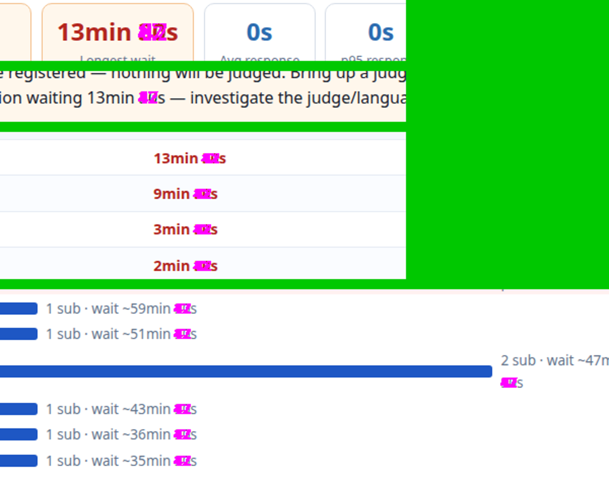
  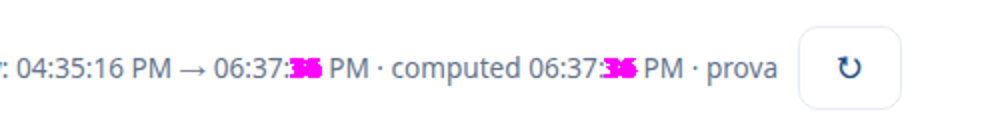

## Cobertura: estados condicionais (cenários)

O fixture base é **um instante só**: prova em andamento há 2 h, falta 1 h, placar congelado há
30 min, modo ICPC, balão no estilo `fill`, todo time com alguma submissão. Muitas telas só mostram
uma parte quando outra condição vale. Por isso a comparação ganhou **cenários**
([`ferramentas/cenarios.sh`](ferramentas/cenarios.sh), executados por
[`ferramentas/run-cenarios.sh`](ferramentas/run-cenarios.sh)). Cada cenário parte de uma cópia limpa
do fixture, muda o estado (conf, placar, history, sessões), e A × B é comparado nas telas afetadas.
A miniatura de B de cada tela que passou fica em [`fotos/cenarios/<cenário>/`](fotos/cenarios/),
como prova de que o estado apareceu de fato. Uma tela que "passa" sem mostrar o estado não prova
nada.

| Cenário | Condição que liga | O que passa a aparecer | Resultado |
|---|---|---|---|
| (base) | prova em andamento, congelada | placar congelado com aviso, balões `fill`, ★, pendentes, filas, avaliação, cerimônia parada | 216/216 |
| `antes` | `CONTEST_START` no futuro | contagem regressiva no lugar dos problemas, placar-**vitrine** (sem colunas de problema), login escondido atrás de "Organização? Entrar" | 14/14 |
| `aberto` | `FREEZE_TIME=0` com a prova rodando | placar completo para o time, **sem** aviso de congelamento, 📷 das fotos | 6/6 |
| `encerrado` | `CONTEST_END` no passado, ainda congelado | "Contest ended", cerimônia pronta com as células pendentes, Central pós-prova | 16/16 |
| `final` | encerrada e descongelada + módulo `virtual` | placar final aberto, botão da participação virtual | 8/8 |
| `icone` | `SCORE_BALLOON_STYLE` ausente (o **padrão**) | balão como bolinha sobre fundo neutro, no placar, na cerimônia e na lista de problemas | 10/10 |
| `obi` | `CONTEST_TYPE=obi` | placar de **notas** (outro renderizador, `score-obi.js`): células por faixa de nota, sem balão nem penalidade | 8/8 |
| `convidados` | coluna `guest` + `GUEST_NUMBERING=1` | linha de convidado em cinza, etiqueta "guest", numeração própria em itálico | 6/6 |
| `vazio` | time sem nada; filas, avaliações, clarifications e notícias zeradas | as mensagens de lista vazia ("No submissions yet.", "No tasks."…) em 10 telas | 20/20 |
| `treino` | contest `treino` com 8 problemas públicos, contagens e uma aluna com histórico | home com Top 10 e "Recently solved", treino com coleções, página de problema, perfil, **gestão** e **editor** de problemas | 20/20 depois de R6 e R7 |
| `interacao` | cliques antes da foto (ganchos do `shots-server.py`) + reserva de avaliação gravada | sanfona do problema aberta (enunciado, exemplos, editor; o H só em PDF), cerimônia no meio, "editar resposta", links do telão, painel de avaliação do juiz | 12/12 |

O cenário `treino` foi o que achou o **R6** e o **R7**: na rodada principal, `/`, `/treino/`,
`/problemas/` e o editor tinham sido capturados sem sessão e sem dados, com 1366 × 900 px (só o
cabeçalho), e "passaram" sem ter conteúdo.

## Mudanças relevadas

| # | Mudança | Commit | Primeira tela | Veredito |
|---|---|---|---|---|
| R1 | Botão ☾ do tema escuro na barra | `be1bc4f1` | `/api/index.html` @1366 | Intencional |
| R2 | Borda dos tutoriais: quase preta → cinza-claro | `17de7325` | `/contest/ajuda/animeitor.html` @1366 | Intencional (correção) |
| R2b | A mesma borda nos chips `.cycle span` | `17de7325` | `/problemas/tutorial.html` @1366 | Intencional (mesma causa do R2) |
| R3 | Índice dos tutoriais deixa de grudar no celular | `32670369` | `/contest/ajuda/animeitor.html` @390 | Intencional (correção) |
| R4 | Cadastro do treino: contorno do cartão e dos campos unificado em `#d0d7de` | `17de7325` | `/treino/cadastro/index.html` @1366 | Aceitável (efeito colateral imperceptível) |
| R5 | Link da página atual sublinhado no quicknav de badges e animeitor | `6bdaf638` | `/contest/badges/` [s_cstaff] @1366 | Intencional (declarado no commit) |
| R6 | Gestão de problemas: contornos quase pretos → cinza-claro | `17de7325` | `/problemas/` [s_treino] @1366 (cenário `treino`) | Intencional (mesma causa do R2) |
| R7 | Editor de problemas: barras e abas de tema escuro → claras | `17de7325` | `/problemas/editar.html` [s_treino] @1366 (cenário `treino`) | Intencional (correção, a maior do conjunto) |

### R1: botão ☾ do tema escuro na barra

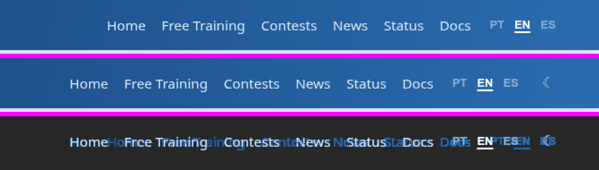

*De cima para baixo: A, B e o filtro `A == B ? 0 : B`, sobre fundo escuro.*

- **Onde:** na barra de todas as páginas do site (`site-header.js`) e no chip de usuário das
  páginas de contest (`contest-shell.js`). O botão é o `.theme-toggle` de `web/shared/theme.js`.
- **O que muda:** 3.405 px, todos numa faixa só (y 21–37, x 778–1317). O botão ocupa espaço à
  direita e empurra o menu (Home … Docs · PT EN ES) uns 40 px para a esquerda. No filtro, o menu
  inteiro aparece porque mudou de posição, não de estilo. O resto da captura (1366 × 16.000 px) é
  idêntico.
- **Veredito:** intencional. É a contribuição 5 do `RELATORIO-CSS-MODULAR.md` (tema escuro opt-in).
- **Observação para o relatório:** a seção 6 diz "zero custo para quem usa o claro". Isso vale
  para o CSS baixado, mas o botão é visível para todo mundo. Falta uma linha dizendo que ele muda a
  barra de todas as telas.
- **Neutralização em B:** `.theme-toggle { display: none !important; }`

Fotos: [`fotos/01-api-index@1366/`](fotos/01-api-index@1366/)

### R2: borda dos tutoriais, de quase preta para cinza-claro

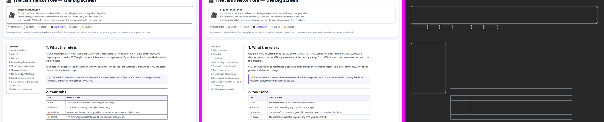

*Da esquerda para a direita: A, B e o filtro `A == B ? 0 : B`, sobre fundo escuro. Trecho do topo
da página (y 160–1000).*

- **Onde:** todas as páginas com o layout de tutorial: as de papel em `/contest/ajuda/`, e também
  `contest/cli.html`, `treino/cli.html`, `problemas/tutorial.html` e `treino/criar/tutorial.html`.
  Contornos do índice (`.ttoc`), do cabeçalho do papel (`.rolehead`), dos chips de papel
  (`.rolenav a`), das tabelas (`.cheat`), dos blocos de código (`.tmain pre`), das capturas
  (`.shot img`) e o separador acima de cada `h2`.
- **O que muda:** 39.099 px em 15 faixas pela página inteira. 37.243 deles são exatamente
  `#2a2a2a → #d0d7de`. O resto é a mesma borda misturada com o fundo nos cantos arredondados
  (antialiasing). **Em nenhum pixel B ficou mais escuro que A**, e não há diferença de posição
  (altura igual, 1366 × 9.060).
- **Causa:** em A, o `_tutorial.css` usava `var(--border, #2a2a2a)`, mas a variável `--border`
  **nunca era definida**. O navegador caía no valor reserva, pensado para tema escuro. No HEAD,
  o `tokens.css` define `--border` e o componente `components/tutorial.css` usa
  `--color-border-strong` (`#d0d7de`).
- **Veredito:** intencional. É a "única mudança visual" descrita na seção 1 do
  `RELATORIO-CSS-MODULAR.md` (cinco tokens usados sem definição).
- **Alcance maior do que esta tela:** em A havia **50** usos de `var(--border, #2a2a2a)`, também em
  `problemas/editar.html` (20), `problemas/index.html`, `treino/cadastro/`, `treino/virtual/` e no
  `ui.css`. Há ainda usos com outro valor reserva (`#d0d7de` ×4, `#cbd5e1`, `#ccc`, `#e2e8f0`). Esses
  **não** estão neutralizados por esta regra e vão parar a comparação para revisão própria.
- **Neutralização em B:** restrita aos seletores do `_tutorial.css` de A. Não dá para sobrescrever
  `--color-border-strong`, porque esse token também é usado em contornos que não mudaram, e isso
  criaria diferenças falsas.
  O chip ativo (`.rolenav a.cur`) fica de fora: ele tem contorno roxo próprio, e a 1ª versão da
  regra o pintava de cinza-escuro em B, um falso positivo de 314 px.
  ```css
  .ttoc, .tmain pre, .cheat th, .cheat td, .shot img, .rolehead, .rolenav a:not(.cur), .cycle span { border-color: #2a2a2a !important; }
  .tmain h2 { border-top-color: #2a2a2a !important; }
  ```

Fotos: [`fotos/02-ajuda-animeitor@1366/`](fotos/02-ajuda-animeitor@1366/)

#### R2b: a mesma borda nos chips do ciclo (`/problemas/tutorial.html` @1366)

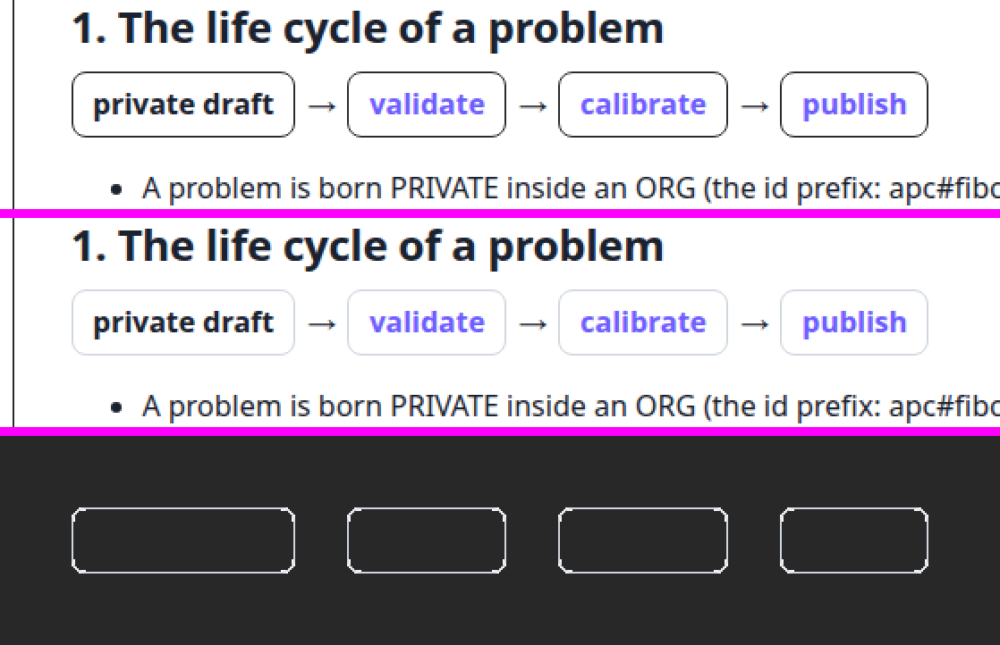

- **O que muda:** 1.160 px numa faixa só (x 315–793, y 437–473), todos na borda dos chips
  `.cycle span` (validar → calibrar → publicar): `#2a2a2a → #d0d7de` e o antialiasing dos cantos.
- **Prova de que é só a cor:** medido no navegador, o primeiro chip fica em (314,6; 436,7), com
  125,9 × 37,2 px, **nos dois lados**. A cor da borda passa de `rgb(42, 42, 42)` para
  `rgb(208, 215, 222)`.
- **Por que parou de novo:** o `.cycle span` não está no `_tutorial.css`. Ele está no `<style>` de
  `problemas/tutorial.html` e de `treino/criar/tutorial.html`, também com
  `var(--border, #2a2a2a)`. É a mesma causa e o mesmo veredito do R2; o seletor entrou na regra de
  neutralização acima.

Fotos: [`fotos/02b-problemas-tutorial@1366/`](fotos/02b-problemas-tutorial@1366/)

### R3: índice dos tutoriais deixa de grudar no celular

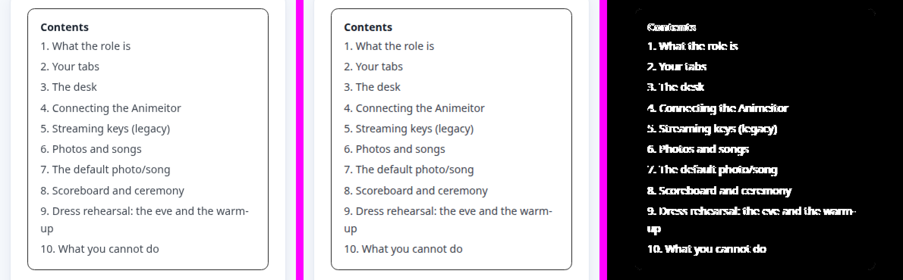

*Da esquerda para a direita: A, B e a diferença **amplificada 20×** (o filtro puro fica quase
invisível, porque os pixels de B diferem muito pouco dos de A). Trecho do índice.*

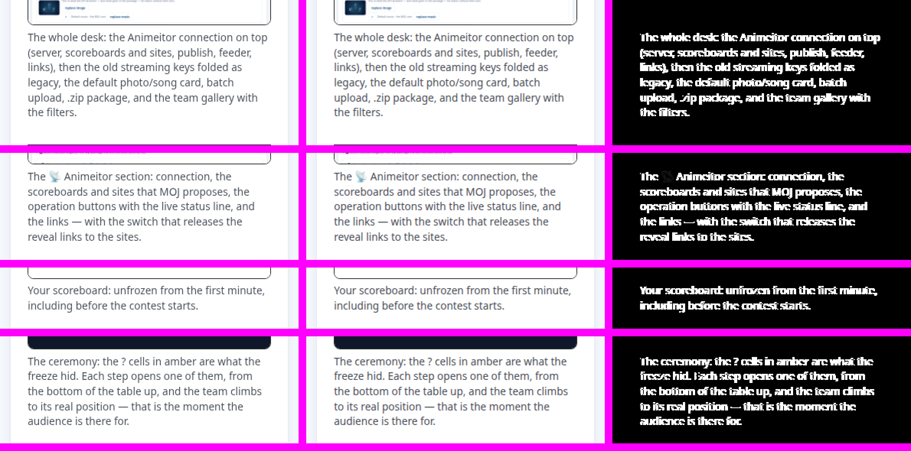

*As outras quatro faixas da página: legendas das capturas, com o mesmo padrão.*

- **Onde:** só a 390 px (regra `@media (max-width: 900px)`), em toda página com o layout de
  tutorial. A 1366 px nada muda.
- **O que muda:** 41.067 px em 5 faixas: o índice e quatro legendas de captura. **Nenhum pixel
  muda de lugar e nenhuma cor de estilo muda.** O texto está na mesma posição e só o contorno das
  letras difere: as franjas coloridas do antialiasing de subpixel (`#ffffff → #f8ffff`,
  `#474e57 → #464e57`). A luminância média nas faixas difere de 0,9 a 2,8 níveis em 255.
- **Causa:** em A, a regra `@media` com `.ttoc { position: static }` vinha **antes** da regra base
  `.ttoc { position: sticky }` e perdia para ela. No celular, o índice grudava no topo e ficava
  transparente, por cima do texto, ao rolar. O commit `32670369` pôs o `@media` depois. Como
  consequência, o Chrome deixa de pôr o índice (e o texto que ele poderia sobrepor) numa camada
  própria, e esse texto passa de antialiasing em tons de cinza para antialiasing de subpixel. Na
  captura da página inteira, o efeito aparece como troca de antialiasing. Rolando a página, a
  diferença real é o índice que não gruda mais.
- **Prova:** com a regra abaixo em B (devolve o `sticky`), a tela passa de 41.067 px para **0 px**.
- **Veredito:** intencional. É a última linha da tabela da seção 6 do
  `RELATORIO-CSS-MODULAR.md` ("Índice dos tutoriais: não gruda mais por cima do texto no celular").
- **Neutralização em B:**
  ```css
  @media (max-width: 900px) { .ttoc { position: sticky !important; } }
  ```

Fotos: [`fotos/03-ajuda-animeitor@390/`](fotos/03-ajuda-animeitor@390/)

### R4: cadastro do treino, contornos unificados em `#d0d7de`

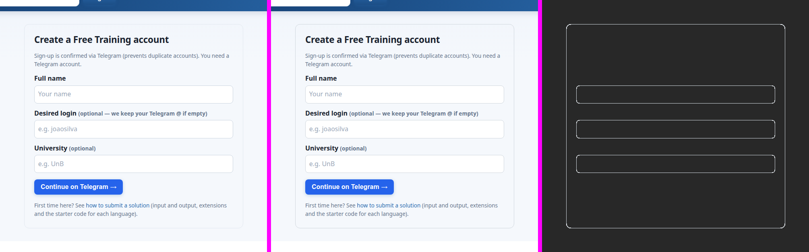

*Da esquerda para a direita: A, B e o filtro `A == B ? 0 : B`, sobre fundo escuro.*

- **Onde:** `/treino/cadastro/`: o contorno do cartão e dos três campos.
- **O que muda:** 5.414 px, só nos contornos. O cartão passa de `#e2e8f0` para `#d0d7de` (fica um
  pouco **mais escuro**), e os campos passam de `#cbd5e1` para `#d0d7de` (ficam um pouco **mais
  claros**). O resto são os cantos arredondados (antialiasing). A olho nu, as duas telas são iguais.
- **Causa:** a mesma do R2, com outra consequência. O `<style>` da página usava
  `var(--border, #e2e8f0)` no cartão e `var(--border, #cbd5e1)` nos campos. Como `--border` nunca
  era definido, cada um caía no **seu** valor reserva, e esses já eram claros. Hoje o CSS da página
  (`styles/pages/treino-cadastro.css`) usa `--color-border-strong` nos dois.
- **Veredito:** aceitável, mas **não é a correção descrita no relatório**. Aqui nada estava
  "escuro por engano": a página já tinha os tons que o autor escolheu, e a troca de token os
  unificou. É um efeito colateral pequeno, não uma melhoria.
- **Para o relatório:** a seção 1 fala só das bordas "quase pretas" (`#2a2a2a`). Em A havia mais 7
  usos de `var(--border, …)` com reserva claro (`#d0d7de` ×4, `#cbd5e1`, `#ccc`, `#e2e8f0`), e esses
  também mudaram de cor, de leve.
- **Contraste do campo:** o contorno do campo contra o branco cai de 1,48:1 para 1,45:1 (o do
  cartão sobe de 1,23:1 para 1,45:1). Os dois já ficavam abaixo dos 3:1 que a WCAG 1.4.11 pede para o limite de um campo de
  formulário. Não é regressão relevante, mas é um ponto de acessibilidade que já existia.
- **Neutralização em B:** só nesta página, reconhecida pelo `<link>` do CSS próprio (que só existe
  em B):
  ```css
  html:has(link[href$="pages/treino-cadastro.css"]) .card { border-color: #e2e8f0 !important; }
  html:has(link[href$="pages/treino-cadastro.css"]) .card input { border-color: #cbd5e1 !important; }
  ```

Fotos: [`fotos/04-treino-cadastro@1366/`](fotos/04-treino-cadastro@1366/)

### R5: link da página atual sublinhado em badges e animeitor

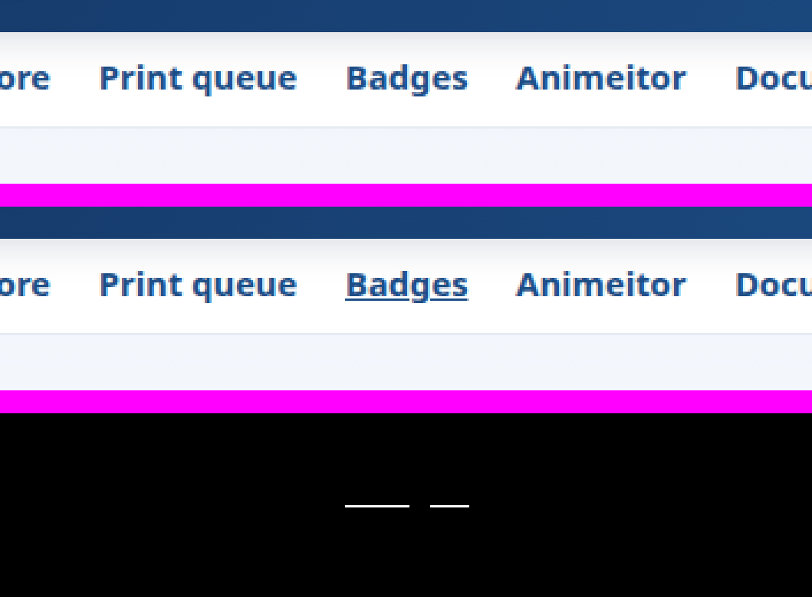

*De cima para baixo: A, B e a diferença amplificada 10×. Barra de navegação do contest.*

- **Onde:** a barra de navegação (`.quicknav`) de `/contest/badges/` e `/contest/animeitor/`.
- **O que muda:** 45 px numa linha só (y 132, x 187–240): o sublinhado debaixo de "Badges", o
  link da página atual. Nada mais muda na página.
- **Causa:** a regra `.quicknav a.active { text-decoration: underline }` era copiada no `<style>`
  de 18 páginas de contest. Badges e animeitor tinham esquecido a cópia, então o link da página
  atual não se destacava nelas (o `contest-shell.js` já o marcava com `.active`). O commit
  `6bdaf638` levou a regra para `components/topbar.css`, e ela passou a valer nas duas.
- **Veredito:** intencional, e **declarado no próprio commit** ("Mudança visual DELIBERADA, em três
  páginas que tinham esquecido a cópia"). Deixa as duas páginas iguais às outras 18.
- **Ainda por conferir:** o mesmo commit cita uma 3ª mudança, o título da prova em `treino/ajuda`
  quando aberto no subdomínio de um contest. A captura usa o site principal, onde esse cabeçalho
  sai do DOM, então esta rodada não a exercita.
- **Neutralização em B:** só nas duas páginas, reconhecidas pelo CSS próprio de cada uma (as
  outras 18 já sublinhavam em A):
  ```css
  html:has(link[href$="pages/contest-badges.css"]) .quicknav a.active,
  html:has(link[href$="pages/contest-animeitor.css"]) .quicknav a.active { text-decoration: none !important; }
  ```

Fotos: [`fotos/05-contest-badges-cstaff@1366/`](fotos/05-contest-badges-cstaff@1366/)

### R6: gestão de problemas, contornos quase pretos para cinza-claro

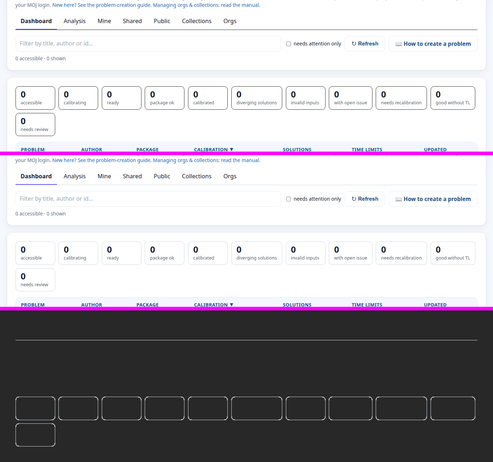

*De cima para baixo: A, B e o filtro `A == B ? 0 : B`, sobre fundo escuro.*

- **Onde:** `/problemas/` (também alcançada por `/treino/problemas/`, que só redireciona para lá), com
  alguém logado. A linha sob as abas e o contorno dos 11 cartões de contagem do Painel.
- **O que muda:** 5.612 px em duas faixas, `#2a2a2a → #d0d7de` mais o antialiasing dos cantos.
- **Causa:** a mesma do R2. O `<style>` de A usava `var(--border, #2a2a2a)` em `.tabs`, `.scard`,
  `.coll`, `.chip` e na prévia (`#detail iframe`).
- **Por que só apareceu agora:** na rodada principal, `/problemas/` foi capturada **deslogada**, com
  1366 × 900 px, isto é, só o cabeçalho. Ela "passou" sem ter conteúdo. Só o cenário `treino`, com
  sessão, a fez renderizar o Painel.
- **Veredito:** intencional, mesma correção do R2.
- **Neutralização em B:** só nesta página; o `.scard.hl` (cartão destacado) tem contorno próprio e
  fica de fora.
  ```css
  html:has(link[href$="pages/problemas.css"]) .tabs { border-bottom-color: #2a2a2a !important; }
  html:has(link[href$="pages/problemas.css"]) :is(.scard:not(.hl), .coll, .chip, #detail iframe) { border-color: #2a2a2a !important; }
  ```

Fotos: [`fotos/06-problemas-gestao@1366/`](fotos/06-problemas-gestao@1366/)

### R7: editor de problemas, de barras de tema escuro para o tema claro

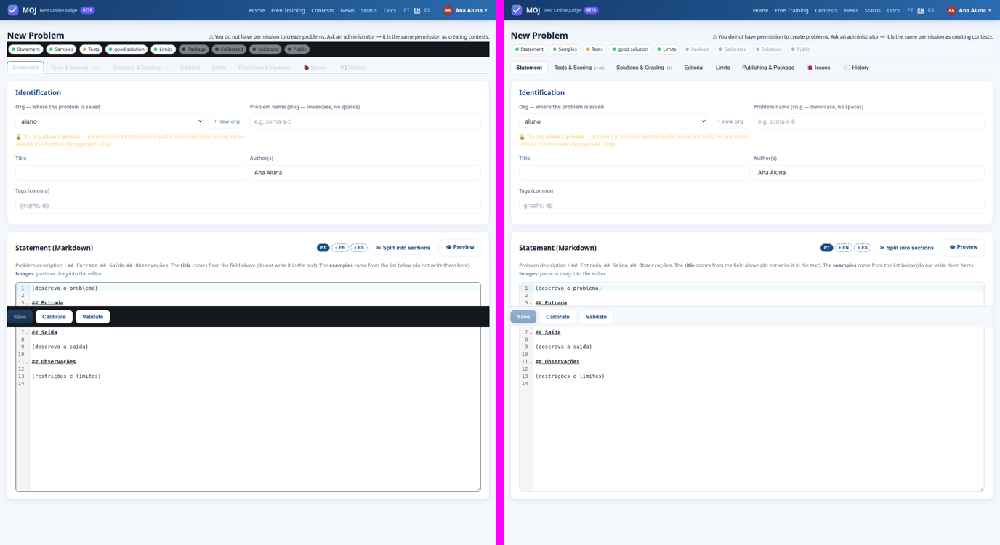

*À esquerda A, à direita B. Editor aberto em "New Problem", com uma aluna logada.*

- **Onde:** `/problemas/editar.html`.
- **O que muda:** 126.225 px, a maior diferença do conjunto:
  - a faixa de prontidão fixa no topo (Statement · Samples · Tests…) e a barra fixa de
    Save / Calibrate / Validate eram **quase pretas** (`#14171c`) e ficam claras;
  - as abas (Tests & Scoring, Solutions & Grading…) tinham **texto cinza-claro** (`#cdd6e4`) sobre
    fundo branco, quase ilegível, e ficam com o texto normal;
  - a borda do editor de enunciado passa de `#2a2a2a` a `#d0d7de`.
- **Causa:** a mesma família do R2, com mais variáveis. Em A, `--bg`, `--border` e `--fg` **não
  existiam**. O `<style>` do editor usava `var(--bg, #14171c)`, `var(--fg, #cdd6e4)` e
  `var(--border, #2a2a2a)`, reservas pensadas para tema escuro. Hoje as três são aliases de tokens
  semânticos claros.
- **Veredito:** intencional. É a correção descrita na seção 1 do relatório ("o editor tinha uma
  barra fixa quase preta e abas com texto cinza-claro sobre branco"), e é claramente uma melhoria.
- **Prova de que é só isso:** com o `<style>` de A reaplicado em B (abaixo), o editor dá **0 px** a
  1366 e a 390 px. Nenhuma outra regra do editor mudou o que aparece nesse estado.
- **Neutralização em B:** o `<style>` **inteiro** do editor de A, reaplicado só nesta página, com as
  três variáveis trocadas pelas reservas que o navegador usava. É gerado por
  [`ferramentas/gen-neutral.py`](ferramentas/gen-neutral.py), porque são cerca de 20 regras com
  variantes de estado (`.tab.on`, `.subtab…`), e uma lista feita à mão erraria a especificidade (foi
  o que aconteceu com o chip ativo no R2):
  ```sh
  git show a8f45511:web/problemas/editar.html \
    | ferramentas/gen-neutral.py pages/problemas-editar.css --bg --border --fg
  ```
- **Limite:** só a aba **Enunciado** de um problema novo foi comparada. As outras abas (testes,
  soluções, calibração, limites, histórico) precisam de um problema existente numa org de que o
  login seja membro, e isso não está no fixture (ver "Lacunas que continuam").

Fotos: [`fotos/07-problemas-editor@1366/`](fotos/07-problemas-editor@1366/)

## Achados laterais (fora do escopo do CSS)

Coisas que apareceram nas capturas, **iguais em A e em B**. Não vêm da série do CSS, mas valem uma
issue:

1. **Antes do início, o cabeçalho da página do competidor conta até o FIM.** No cenário `antes`,
   `/contest/` mostra "Ends in: 04:00:25" (o tempo até o fim da prova), enquanto o placar mostra
   corretamente "Starts in: 01:00:25". Foto: [`fotos/cenarios/antes/`](fotos/cenarios/antes/).
2. **Com a prova encerrada, a página ainda oferece "Choose file / Submit"** em cada problema
   (cenário `encerrado`). A API recusa o envio (`competitor_write_guard`), mas a tela convida a
   enviar. Foto: [`fotos/cenarios/encerrado/`](fotos/cenarios/encerrado/).
3. **Contraste do contorno dos campos do cadastro:** abaixo de 3:1 em A e em B (ver R4).
4. **Na página do competidor, a linha "Finished rounds" aparece ou não conforme a ordem das
   respostas da API** (corrida entre duas requisições). Com a espera por rede ociosa ela estabiliza,
   mas num navegador lento o usuário pode ver a seção de recursos "piscar".

## Lacunas que continuam

O que esta rodada **não** cobre, em ordem de risco:

- **Tema escuro.** Só existe em B (opt-in pelo ☾), então não há A para comparar. O relatório diz
  que o contraste foi conferido (149/149), mas nenhuma tela escura foi fotografada aqui.
- **Abas internas do editor de problemas** (testes, soluções, calibração, limites, histórico) e a
  **gestão com problemas listados.** Precisam de um problema de verdade numa org de que o login seja
  membro (pacote git, índice de donos, `orgs.json`). O R7 prova só a aba Enunciado de um problema
  novo.
- **Idiomas pt e es.** O fixture é em inglês (`LOCALE=en`). Texto mais longo pode quebrar linha de
  outro jeito, mas o CSS é o mesmo nos três idiomas.
- **Hover, foco e `<details>` abertos nos painéis do admin.** O cenário `interacao` cobre as
  interações que os tutoriais usam (sanfona, cerimônia, editar resposta, links do telão, painel de
  avaliação), não todas.
- **Outros modos de placar** (`heuristic`, `outro`), **placar por coorte** (`?view=`), **contest
  secreto**, **inscrição aberta/fechada**, **título da prova em `treino/ajuda` no subdomínio de um
  contest** (a 3ª mudança declarada no commit do R5) e a **participação virtual com dados**.
- **Relatório offline** (`report-gen.sh`) e **impressão** (`@media print`): nenhuma das duas passa
  pelo navegador desta comparação.
